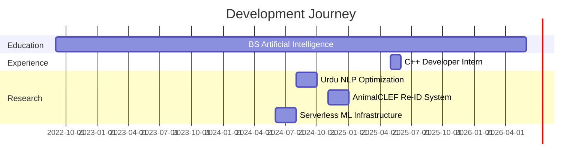

#  Welcome to my Neural Network

<div align="center">

```ascii
    ___    ____  __  ______    _   __   _________   _____ ____ ___ __
   /   |  / __ \/  |/  /   |  / | / /  / ____/   | /  _// __ / ___/ /
  / /| | / /_/ / /|_/ / /| | /  |/ /  / /_  / /| | / / / /_/ \__ \/ /
 / ___ |/ _, _/ /  / / ___ |/ /|  /  / __/ / ___ |/ / _\__  /__/ / /___
/_/  |_/_/ |_/_/  /_/_/  |_/_/ |_/  /_/   /_/  |_/___//____/____/_____/

```

<h3>
  
  AI/ML Engineer | Full-Stack Developer | Cloud Architect
  
</h3>

[](https://git.io/typing-svg)

</div>

---

## 🎯 System.getCurrentStatus()

```javascript
const arman = {
  location: "Karachi, Pakistan 🇵🇰",
  education: "BS Artificial Intelligence @ FAST-NUCES",
  currentMission: "Bridging AI Research & Production Deployment",
  
  specializations: {
    nlp: ["BPE Tokenization", "Low-Resource Languages", "Urdu NLP"],
    vision: ["Re-Identification Systems", "Metric Learning", "OpenCV"],
    mlops: ["AWS Lambda", "Docker", "ONNX Optimization", "Serverless"]
  },
  
  achievements: {
    tokenOptimization: "7.08% reduction in Urdu token fertility",
    latencyBoost: "90% cold-start latency reduction",
    imageCompression: "70% Docker image size optimization",
    systemsDeployed: "Multiple production AI systems"
  },
  
  currentlyLearning: ["Advanced MLOps", "Distributed Training", "Edge AI"],
  openToCollaborate: true,
  askMeAbout: ["AI", "NLP", "Cloud Architecture", "Full-Stack Dev"]
};
```

---

## 🎓 Education & Academic Journey

<table>
<tr>
<td width="70%">

### 🎯 Bachelor of Science in Artificial Intelligence
**FAST - National University of Computer & Emerging Sciences**  
📍 Karachi, Pakistan | 🗓️ 2022 - 2026 (Expected)

**Focus Areas:**
- 🧠 Natural Language Processing & Low-Resource Languages
- 👁️ Computer Vision & Deep Metric Learning
- ☁️ Cloud-Native AI Architectures & MLOps
- 🚀 Production ML Systems & Model Optimization

Combining rigorous AI theory with hands-on experience in deploying real-world ML systems. Active in research on optimizing models for Urdu and building scalable inference pipelines.

</td>
<td width="30%">

### 📚 Pre-University

**GCE A Levels**  
*Cedar College*  
Pre-Engineering  
🗓️ 2020 - 2022

**GCE O Levels**  
*St. Michael's Convent*  
🗓️ 2018 - 2020

</td>
</tr>
</table>

---

## ⚡ Tech Stack & Expertise

<details open>
<summary><b>🤖 Machine Learning & AI</b></summary>

<br>

| Category | Technologies |
|----------|-------------|
| **Deep Learning** |    |
| **NLP** |   BPE Tokenization |
| **Computer Vision** |   Metric Learning |
| **Data Science** |    |

</details>

<details open>
<summary><b>💻 Development Stack</b></summary>

<br>

**Languages:**  


**Frontend:**  


**Backend:**  


</details>

<details open>
<summary><b>☁️ Cloud & DevOps</b></summary>

<br>


</details>

---

## 🚀 Featured Projects

<table>
<tr>
<td width="50%" valign="top">

### 🔤 [Urdu Two-Stage BPE Tokenizer](https://github.com/ArmanFaisal)

> Solving LLM inefficiencies for low-resource languages

**The Challenge:** LLMs tokenize Urdu inefficiently, wasting context window space and slowing inference.

**The Solution:** Built a script-aware two-stage BPE tokenizer with:
- ✅ Regex-based pre-tokenization
- ✅ Unicode normalization
- ✅ Linguistic validity preservation

**Impact:** 🎯 **7.08% reduction** in token fertility

**Stack:** `Python` `NLP` `BPE` `Unicode` `Regex`

</td>
<td width="50%" valign="top">

### 🐾 [AnimalCLEF25 Re-ID System](https://github.com/ArmanFaisal)

> Deep metric learning for wildlife monitoring

**The Challenge:** Fine-grained animal identification at scale for ecological research.

**The Solution:** End-to-end Re-ID pipeline featuring:
- ✅ Deep metric learning with triplet loss
- ✅ Automated preprocessing pipeline
- ✅ Similarity-based retrieval system

**Impact:** 🎯 Scalable wildlife tracking

**Stack:** `PyTorch` `OpenCV` `Metric Learning` `Computer Vision`

</td>
</tr>

<tr>
<td width="50%" valign="top">

### ☁️ [Serverless MNIST Digit Recognizer](https://github.com/ArmanFaisal)

> Production-grade ML inference at scale

**The Challenge:** Deploy ML models with minimal latency and cost.

**The Solution:** Serverless architecture with:
- ✅ AWS Lambda + Docker containerization
- ✅ ONNX Runtime optimization
- ✅ FastAPI for REST endpoints

**Impact:** 🎯 **90% latency reduction** | **70% image size reduction**

**Stack:** `AWS Lambda` `Docker` `ONNX` `FastAPI` `Python`

</td>
<td width="50%" valign="top">

### 🌐 [Gold Leaf Ghostwriting](https://github.com/ArmanFaisal)

> Modern web platform with Tailwind v4

**The Challenge:** High-end responsive site with seamless UX.

**The Solution:** Cutting-edge web stack featuring:
- ✅ React + Tailwind CSS v4
- ✅ Advanced dark mode architecture
- ✅ Supabase backend integration

**Impact:** 🎯 Production-ready client platform

**Stack:** `React` `Tailwind v4` `Supabase` `CSS Variables`

</td>
</tr>
</table>

---

## 📊 GitHub Metrics

<div align="center">


</div>

---

## 💼 Professional Timeline



---

## 🏆 Achievements Unlocked

<div align="center">

| 🎯 Optimization | 📊 Metrics | 🚀 Production |
|----------------|-----------|---------------|
| Token Fertility: **-7.08%** | Models Deployed: **5+** | Serverless Systems: **3** |
| Latency: **-90%** | Languages: **8+** | Docker Images: **10+** |
| Image Size: **-70%** | GitHub Stars: **Growing** | API Endpoints: **15+** |

</div>

---

## 📫 Transmit Signal

<div align="center">

[](mailto:armanfaisal0007@gmail.com)
[](https://linkedin.com/in/armanfaisal)
[](https://github.com/ArmanFaisal)
[](https://armanfaisal.dev)

</div>

---

<div align="center">

### 💡 Daily Wisdom


### 🐍 Contribution Snake


---

```ascii
╔═══════════════════════════════════════════════════════════╗
║  "Any sufficiently advanced technology is                 ║
║   indistinguishable from magic."                          ║
║                                    - Arthur C. Clarke     ║
╚═══════════════════════════════════════════════════════════╝
```

**⚡ Powered by curiosity, driven by innovation**

</div>
